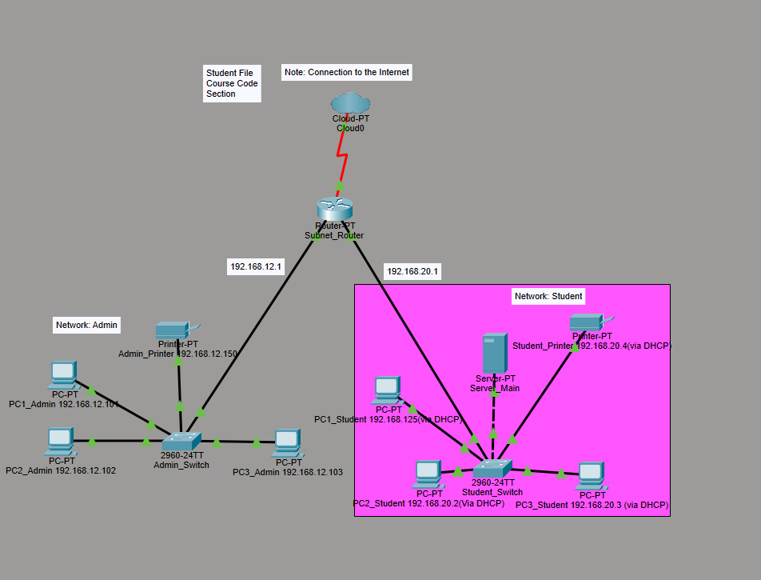
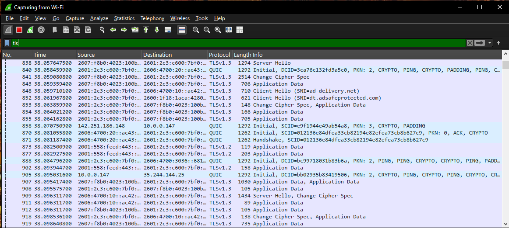
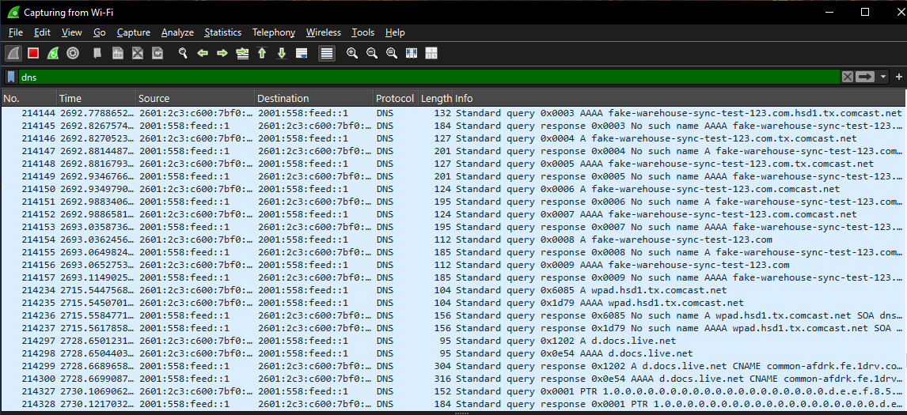
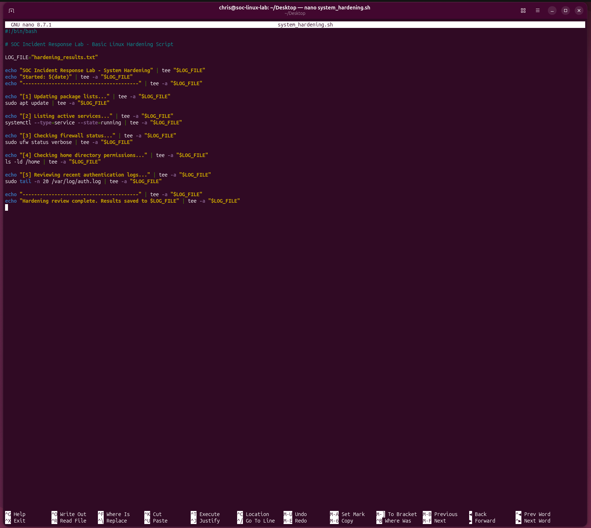
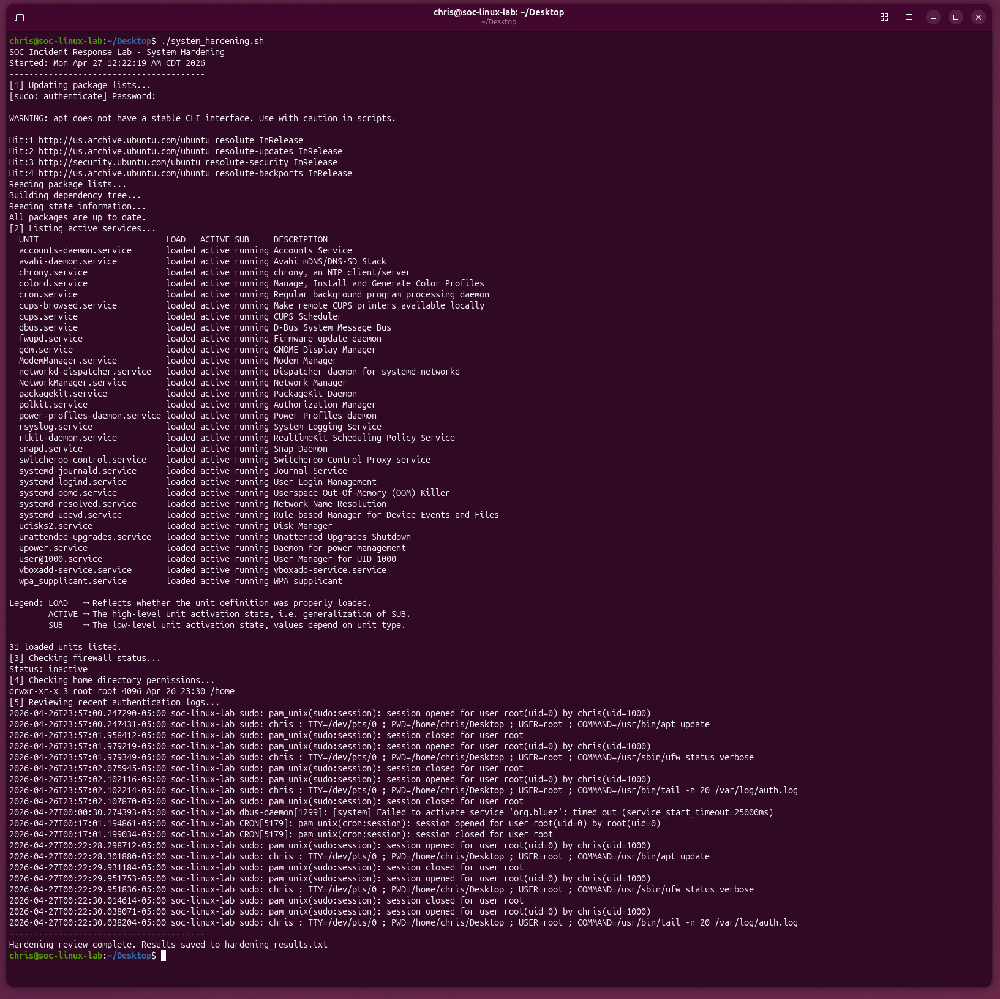
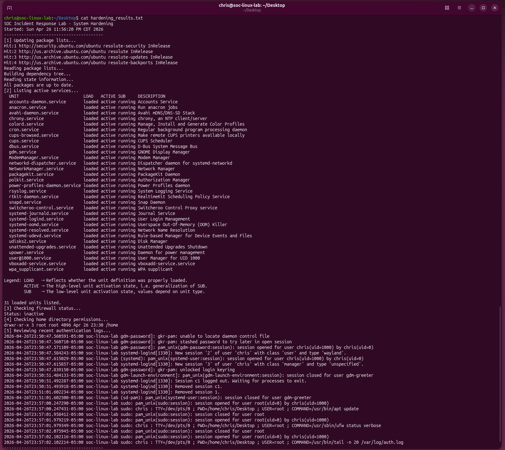

# SOC Incident Response Lab

## Overview
This project simulates a SOC-style investigation of suspicious or abnormal network activity using Wireshark. The goal is to analyze traffic patterns, understand how secure communications appear in packet captures, and document how a security analyst could respond to unusual behavior.

---

## 🔷 Project Navigation
- 📄 Incident Report: [DNS Anomaly Investigation](report/incident_report.md)
- 📘 Playbook: [Cybersecurity Playbook (v1)](../Playbooks/cybersecurity-playbook.md)

---

## Network Topology Context

The environment is segmented into two networks:

- **Admin Network (192.168.12.0/24)** – Static IP addressing, controlled devices
- **Student Network (192.168.20.0/24)** – DHCP-based addressing, dynamic endpoints

Both networks connect through a central router which provides access to external resources.

### Analyst Insight

Network segmentation provides important context when analyzing abnormal behavior. DNS failures observed during the investigation could originate from different trust zones:

- From the **student network**, repeated failures may indicate misconfigured applications or automated retry behavior
- From the **admin network**, similar behavior would require deeper investigation due to higher trust level systems

Understanding the network layout improves accuracy when determining whether behavior is malicious or operational.

---

## Objectives
- Capture and analyze network traffic in Wireshark
- Identify normal TLS behavior and compare it to failed or unstable communication
- Demonstrate basic system hardening through scripting
- Connect network and host-level analysis

---

## Tools Used
- Wireshark
- Linux VM (Ubuntu)
- VirtualBox
- Bash scripting
- GitHub

---

## Traffic Analysis

### TLS Traffic Analysis (Normal Behavior)

A packet capture was performed showing a successful TLS 1.3 handshake, confirming normal encrypted communication.

### DNS Failure Analysis (Abnormal Behavior)

Repeated DNS queries to a non-existent domain resulted in "No such name" responses, indicating abnormal or misconfigured behavior.

### Analyst Comparison

TLS traffic represents expected behavior, while DNS failures demonstrate abnormal patterns requiring investigation.

---

## Simulated SIEM Correlation

Although a full SIEM platform was not deployed, this project reflects how a SIEM would correlate multiple data sources.

### Data Sources
- Network traffic (Wireshark)
- DNS queries
- Linux authentication logs (`/var/log/auth.log`)
- System services and host state

### Correlation Logic
The following events were analyzed together:

1. Repeated DNS failures to a non-existent domain
2. Normal TLS traffic occurring at the same time
3. Host-level logs showing no unauthorized access

### Analyst Insight

In a SIEM environment, these events would be correlated to determine whether the behavior is:

- Malicious (e.g., beaconing or command-and-control)
- Misconfiguration (invalid service endpoint or retry loop)
- Operational (temporary failure or connectivity issue)

Based on the combined evidence, the behavior is most consistent with misconfiguration or automated retry activity rather than confirmed malicious behavior.

---

## OT & SRE Perspective

### Systems Thinking Approach

This project is also viewed through an Operational Technology (OT) and Site Reliability Engineering (SRE) lens. The repeated DNS failures could represent more than a security concern; they may also reflect how systems behave when a dependency is unavailable.

The same event can be interpreted from multiple perspectives:

- **SOC perspective:** potential beaconing or suspicious activity
- **OT perspective:** device or system unable to reach a configured endpoint
- **SRE perspective:** retry behavior caused by a failed dependency or service path

### Failure vs Threat Analysis

Instead of immediately classifying the behavior as malicious, the analysis considers how systems behave under failure conditions:

- Applications may retry failed connections
- Services may repeatedly attempt DNS resolution
- Network or configuration issues can create patterns that resemble threats

This approach supports better triage and reduces false positives.

### Real-World Relevance

In OT environments, similar patterns can occur when devices lose connectivity to central systems, experience configuration mismatches, or are impacted by segmentation and communication path issues.

Understanding these behaviors is important because operational failures can appear suspicious at the network level even when the root cause is reliability or configuration related.

---

## Response Actions (Post-Investigation)

### Linux System Hardening Script

A Linux system review script was executed to simulate post-incident response.

The script:
- Updates packages
- Lists running services
- Checks firewall status
- Reviews permissions
- Collects authentication logs

### Analyst Insight

Combining network analysis with host-level inspection helps determine whether abnormal behavior is malicious, misconfigured, or related to system reliability.

---

## Summary

This project demonstrates a full SOC workflow:

- Detection (Wireshark)
- Analysis (TLS vs DNS)
- Correlation (SIEM-style reasoning)
- OT/SRE thinking (failure vs threat analysis)
- Response (Linux system review)

It highlights the importance of correlating network and system data during investigations.
